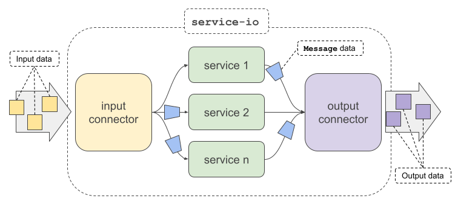
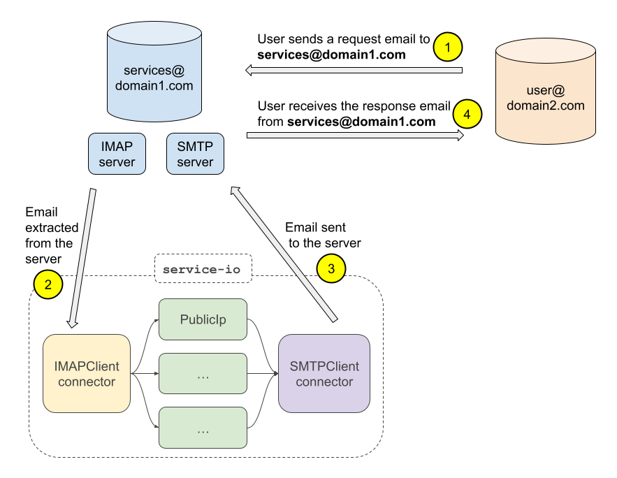

[](https://crates.io/crates/service-io)
[](https://docs.rs/service-io)
[](https://www.apache.org/licenses/LICENSE-2.0.txt)
[](https://www.buymeacoffee.com/lemunozm)

<p align="center">
  
</p>

`service-io` is a library to build servers that offering services with really little effort.

1. Choose an input connector.
2. Choose an output connector.
3. Choose your services.
4. Run it!

One of the main use-cases is to offer services [without hosting a server](#no-hosting-server).

## How it works?
<p align="center">
  
</p>

All of them, **inputs**/**outputs** and **services** "speak" the same language:
the [`Message`](https://docs.rs/service-io/latest/service_io/message/struct.Message.html) type.

Inputs obtain and transform input data into a `Message`.
Services receive `Message`s and generate other `Message`s usually doing some kind of processing.
Outputs transform a `Message` into output data and deliver it.

Check the current built-in input/output
[connectors](https://docs.rs/service-io/latest/service_io/connectors/index.html)
and
[services](https://docs.rs/service-io/latest/service_io/services/index.html).

## Features
- **Easy to use**. Running a server with a bunch of services with (really) few lines of code.
- **Hostingless**. Run custom server code without hosting server using the existing email infrastructure
  using the IMAP/SMTP connectors.
- **Scalable**. Create your own inputs/outputs/services implementing a trait with a single method.
  [Check docs](https://docs.rs/service-io/latest/service_io/interface/index.html)
- **Multiplatform**. Run your local service-server in any computer you have.

## Getting Started
- [API Docs](https://docs.rs/service-io/latest/service_io/)
- [Examples](examples)

Add the following to your `Cargo.toml`
```toml
service-io = "0.1"
```

## Example
Running this example in any of your home computer,
and sending an email (as an example, to `services@domain.com`)
with `public-ip` in the subject, you will obtain a response email with your home public IP!

In a similar way, sending an email with `process ls -l` in the subject will return
an email with the files of the folder used to run the example.

```rust,no_run
use service_io::engine::Engine;
use service_io::connectors::{ImapClient, SmtpClient, imap};
use service_io::services::{PublicIp, Process, Echo, Alarm};
use service_io::secret_manager::PasswordManager;

#[tokio::main]
async fn main() {
    Engine::default()
        .input(
            ImapClient::default()
                .domain("imap.domain.com")
                .email("services@domain.com")
                .secret_manager(PasswordManager::new("1234")),
        )
        .output(
            SmtpClient::default()
                .domain("smtp.domain.com")
                .email("services@domain.com")
                .secret_manager(PasswordManager::new("1234")),
        )
        .add_service("echo", Echo)
        .add_service("alarm", Alarm)
        .add_service("public-ip", PublicIp)
        .add_service("process", Process)
        // Add any other service you want
        .run()
        .await;
}
```

Any email sent to `services@domain.com` will be interpreted as a request by the `ImapClient` connector.
If the first word of the subject matches `public-ip`, the request will be processed by the `PublicIp` service.
The service `PublicIp` will generate a response that `SmtpClient` will be deliver by email
to the remitter of the request email.

Check the [Engine](https://docs.rs/service-io/latest/service_io/engine/struct.Engine.html) type
for additional methods as input mapping/filters or adding whitelists to your services.

## Test it with a Google account!
Gmail only allow to use **OAuth2** as access mechanism.
You can no longer use a password from an application to log in.
For that reason, in order to use the IMAP and SMTP connectors we need 3 values related to OAuth2: `client_id`, `client_secret` and `refresh_token`.
Follow the next steps to get it:
1. Open your the [google console](https://console.cloud.google.com) associated to the gmail account you want to use.
1. Create a new proyect.
1. Add an OAuth 2.0 credential. This step will five you a `client_id` and `client_secret`.
1. Run the following script to generate a `refresh_token` (this script is the python3 ported of the [gmail-oauth2-tools](https://github.com/google/gmail-oauth2-tools)):
```sh
python3 util/oauth2.py --generate_oauth2_token --client_id=<client_id> --client_secret=<client_secret>
```
1. Open the navigator and copy the value it gives you into the console. This should show you the `refresh_token`.

Now, test if it's working with the [examples/email_server.rs](examples/email_server.rs) example. Run:

```sh
cargo run --example email_server -- \
    --imap-domain imap.gmail.com \
    --smtp-domain smtp.gmail.com \
    --email <user>@gmail.com \
    --oauth2-path-url https://accounts.google.com/o/oauth2/v2/auth \
    --oauth2-token-url https://www.googleapis.com/oauth2/v3/token \
    --oauth2-client-id <client_id> \
    --oauth2-client-secret <client_secret>\
    --oauth2-refresh-token <refresh_token>\
    -vv
```

If you send an email with subject `s-echo` to your `<user>@gmail.com`, in few seconds you should receive the same email.

**Congratulation!** You have your own hostingless server.

## Hostingless server use-case <span id="no-hosting-server"/>
If you want to offer some custom service that uses *custom server code*
you are forced to pay and maintain a hosting server,
even if the service you are offering is eventual or does not use many resources.

To solve this problem, you can use the already existent email infrastructure
using the IMAP and SMTP protocols to handle the emails as requests/responses and link them with your services.

`service-io` helps in this context.
Run locally an instance of `service-io` with IMAP/SMTP connectors.
The IMAP connector will periodically fetch the emails your clients sends,
then your services will process those emails and generate a response,
and finally the SMTP connector will deliver the response emails back to the user.

Anyone from any device with an email client can interact with your local server deployment.
There is **no hosting maintenance** and **no front-end app development**.

<p align="center">
  
</p>

## Contribute
- *Have you implemented a **service** or **connector**?*
  If its functionallity is not private, share it with others!
  Make a *Pull Request* so everyone can use it :)

- *Do you have any cool **idea**, found a **bug** or have any **question** or **doubt**?*
  Do not hesitate and open an issue!
